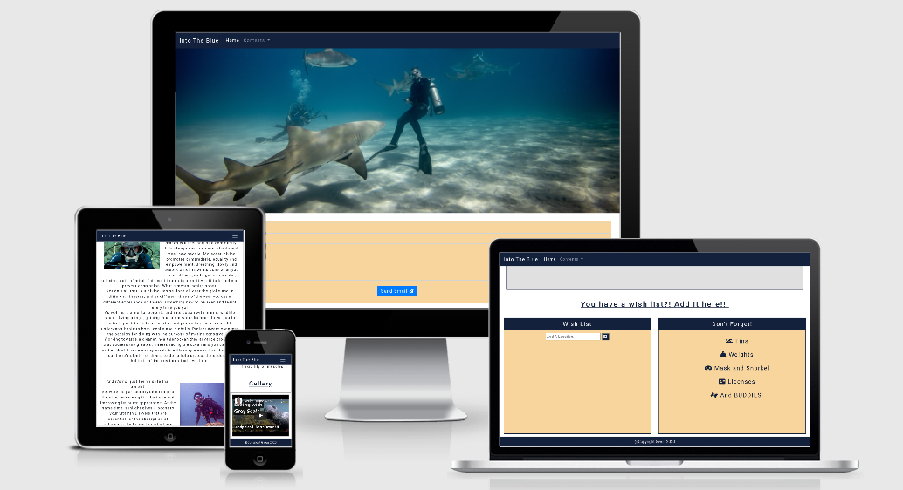

# Into The Blue

- [Introduction](#introduction)
- [UX](#ux)
  * [Goals-](#goals-)
  * [Wireframes-](#wireframes-)
  * [Design](#design)
    + [Design Process-](#design-process-)
    + [Colour Palette-](#colour-palette-)
    + [Font-](#font-)
- [User Stories](#user-stories)
  * [As a Site User-](#as-a-site-user-)
  * [As a Designer-](#as-a-designer-)
  * [As an Employer-](#as-an-employer-)
- [Features](#features)
  * [Exsisting Features-](#exsisting-features-)
    + [Features on the Home Page -](#features-on-the-home-page--)
    + [Features on the UK Divesites page -](#features-on-the-uk-divesites-page--)
    + [Features on the Contact Us page -](#features-on-the-contact-us-page--)
  * [Features left to Implement -](#features-left-to-implement--)
  * [Bugs and Fixes Implemented after Testing -](#bugs-and-fixes-implemented-after-testing--)
- [Technologies Used](#technologies-used)
  * [Languages-](#languages-)
  * [Libraries-](#libraries-)
  * [API's-](#api-s-)
  * [Tools-](#tools-)
- [Testing](#testing)
  * [Validation of Code Testing-](#validation-of-code-testing-)
- [Deployment](#deployment)
    + [Used Commands during Deployment -](#used-commands-during-deployment--)
  * [Hosting on GitHub Pages-](#hosting-on-github-pages-)
  * [Running this Project Locally-](#running-this-project-locally-)
- [Credits](#credits)
  * [Content-](#content-)
  * [Media-](#media-)
  * [Acknowledgements-](#acknowledgements-)
- [Disclaimer](#disclaimer)
    + [This website was made for educational purposes only](#this-website-was-made-for-educational-purposes-only)

<small><i><a href='http://ecotrust-canada.github.io/markdown-toc/'>Table of contents generated with markdown-toc</a></i></small>

## Introduction

This is my second milestone project; Designed to exhibit my capabilities and skills in javascript, as a student
of Code Institute. (https://codeinstitute.net/)
The goal was to showcase my skills to potential employers/recruiters, on a topic that I'm deeply interested in.
My project allows users to discover new divesites within the UK, inspiring them to dive in new locations and more frequently.
It presents a landing page with information on the benefits, both mental and pysical, of scuba diving. The UK divesites page contains a
map with markers pointing at the locations of the UK's best diving spots.
It also boasts an information window opening from the marker, containing specific information on that particular site.
The wish list is a place where users can note down thier favourite dive spots after discovering them on the map.
The contact page allows users to email messages to the site owner.
The website is colourful and engaging, drawing the user in with bright, bold images and standout text, which I hope entices them
to get planning thier next dive trip.

A link to my website can be found [here](https://gwen-bradbury.github.io/MS2/)

## UX

### Goals-

The purpose of the site is to provide a simple, straightforward format presenting information about some of the UK's best divesites.
My website is designed for people interested in diving, specifically diving in the UK, and im hopeful my website
will give them the motivation towards getting into the water more often and diving somewhere new.
The website is fully functional and interactive giving the user a positive experience as they move throught the pages.
I focused on a design that would be engaging and easy to navigate so users will continue to repeatedly visit and make use of the
features inplimented within the website.

### Wireframes-

The carousel of images was added as my mentor wanted to bulk out the project and make it a better portfollio piece.

I was given a new mentor on the 12th October 2020 and due to that have a new mock up instead of a new wireframe with more features that I used to
complete my Milestone 2 Project.

I have produced a mock up of all 3 of my website pages.

### Design

#### Design Process-

1. _Strategy Plane_ - From the onset I knew that my primary aim was to encourage people who scuba dive to explore different divesites in a way that was engaging and simple, therefore stimulating them to get back in the water. My main focus thoughout this project has been to excute this aim. I started the UX process by making a list of user stories, which allowed me to visualise what would be necessary to satisy them.

2. _Scope Plane_ - Having decided the main aim for the project, I began outlining the key features that I wanted my website to have. To do so, I focused on the JavaScript that I wanted to experiment with and ultimately implement, as I knew this would be crucial to the aim of making the website interactive. This led me to decide that I wanted to focus on three key features: a page with a Google Maps API, a wish list for users to add any future divesites they wish to visit and the chance for them to give feedback by way of a contact us form.

3. _Structure Plane_ - Once I had narrowed down the features I wanted to include, I formulated the structure of my design into 3 seperate pages: 'Home', 'UK Divesites', 'Contact Us'. The 'Home' page tells users some of the benefits of scuba diving, with images and a you tube video to entice them back into the water. After this came the 'UK Divesites' page where users can use the google map markers to find new divesites and add the names of those sites into the wish list situated underneath. If the user has any problems, or finds a new divesite to add to the website, or even just wants to stay in touch they can use the contact form to send an email and short message to the website owner. I made navigation through the website easy with a navbar thats the same on every page.

4. _Skeleton Plane_ - As mentioned in the Structure Plane, I decided to use a navbar as the source of navigation through the website. This allows the user to move thoughout the site at a pace that suits them, in the easiest way possible. Returning users can find the page they're looking for, using the navbar, without having to scroll through lots of information they've already seen on previous visits to get to the page they want.

5. _Surface Plane_ -

   - For my design to work, I knew that it would be important to create a theme that would keep the user interested. My first design decision was therefore to make the website as bright and colourful with images and videos of diving experiences to gain and keep thier attention.
   - With this in mind, I began experimenting with my wireframes. I found it useful to generate a color scheme using coolors, which provided me with contrasting colours for my website and found images that complemented that colour scheme. I was introduced to figma towards the end of my project and used it to make mock ups of my websites pages.
   - With the wireframes complete I began experimenting with the Javascript for my features. I used a different workspace for the different javascript needed for each feature.

> Note: Throughout the design process, I kept referring back to my original 'Main Aims' and 'User Stories' to make sure that my project was developing as intended.

#### Colour Palette-

I used coolors to generate my colour scheme-

https://coolors.co/000000-14213d-fca311-e5e5e5-ffffff

I chose  #14213D (Oxford Blue) as the background for my nav bar and headings as I felt it was a colour that best represented the dark depths of the ocean.
 #E5E5E5 (Platinum) was used as the heading text colour as it was a contrast to the Oxford Blue background and made the text stand out.
I also used  #1C20EE as my Send Email button and my nav link hover colour to give more emphasis to the user controls.
The diving and it's benefits sections I left in black and white to make the text easy to read.
I added a background color to the wish list and dont forget sections to try and excite the user whilst they used the map and discovered new divesites.
I decided on color  #f8d59c, as it still contrasted with the heading background but was pale enough to not be a massive distraction for the user.

#### Font-

I used 0.1em letterspacing throught my website to give it a clean, easy to read formatt.
The underline text decoration was used on some of the smaller headings to make them stand out.
I gave the font a size of 120% so the text was easier to read on smaller screen sizes.

## User Stories

### As a Site User-

- As a diver, I want to find new dive sites quickly and easily, and have information on that dive site accessable in an easy to read and understand formatt.
  The about section in index.html tells the user how to use the page and google map to meet thier needs quickly and efficiently.
  The google map markers have been placed on the map on the location of the dive site and, when clicked will open an info window containing relevent information about that particular dive site,
  along with a link to a dive company that runs dives in that area.

- As a user, I want to know how the website works and have easy to follow instructions.

- As a user, I want to know when I take the wrong action or when something doesn't work.

- As a user, I want the website to be interactive with real time feedback.

- As a user, I want the the website to be easy to use and navigate.

### As a Designer-

- As a web designer and developer, I want to track the user behaviour so that I can improve the user experience. I want to track the user behaviour so that I can identify the possible user confusion over navigating the website.
  I want feed back from the users on what features are being used most frequently and ideas on other interesting divesites that can be added to the website in the future.

- As a web designer and developer, I want the website to be interactive and give real time feedback when a user executes an action.

### As an Employer-

- As an employer/recruiter, I need to see and review the skills and work capabilities, and analyze if you have the skills we require. In this website I've used many user-friendly features to showcase my skills as a developer.
  From the layout and colour scheme to the info windows within the google map, every implemented piece of code has been built to make the site as appealing and easy to use for customers as possible.
  Possible employers will be able to see from the website and the features implemented that my standard of work is very high, and my capabilities reflect my current skillset, which will improve as I gain more knowledge moving through
  the Code Institute Full Stack Developer course.

- On our Human Resources team, we look for the information that pertains to the specific needs of the company, and does this individual have those skill sets. My skill sets are evidenced in the website produced. I've used a wide range of HTML, CSS and javascript to
  develop this site, as well as technologies such as bootstrap for responsiveness.

## Features

### Exsisting Features-

#### Features on the Home Page -

- _Navbar_ - Holds the name of the page and links that will take the user to the other pages of the site when clicked. It has a dropdown toggle for use on smaller screens and is fixed so will always be seen by the user. The nav links have an a:hover CSS element that allows the user to see that the cursor is over a nav link and that it can be clicked.

- _Carousel_ - A slide show of images that have been taken whilst diving to encourage divers to explore more of the website and eventually get diving. THe images are bright and bold, to catch the users eye, and are responsive for smaller screen sizes. The carousel was defensively designed with an alt text of placeholder and src of #, as both of those elements are implemented in the carousel.js file and will cause errors when run through a validator.

- _Diving and it's benefits Section_ - Information on the mental and physical benefits of scuba diving, and the benefits to the underwater creatures and thier habitats.

- _Gallery_ - A selection of you tube videos of people diving in the UK to give the users an insight into what UK diving can be like.

- _Footer_ - Includes the copyright information.

The Navbar, Carousel and Footer are repeated on the other pages of the website to give the website pages consistancy and flow.

#### Features on Divesites pages -

- _About Section_ - An introduction to what my site is about and instructions on how to use the features implemented within it.

- _Google Map_ - A familiar google map with markers positioned on the locations of the different dive sites.

- _Information Windows_ - Information windows which open when a dive site marker is clicked. They contain information on the dive site and a link to the website of a dive company that runs dives in that area.

- _Links_ - The links in the information window take the user to the dive companys website which will load on a seperate browser tab.

- _Wish List_ - This section allows the user to make a list of the dive sites they may wish to visit, and stores the list to local storage, allowing them to leave and return to the page without having to rewrite it. Just type the name of the divesite into the box and click the + to add it to the list! You can use the bin icon to remove it from your list if you need to. The bin icon appears next to the location in the list.

- _Don't Forget_ - A list that reminds the user to remember some of the more commonly forgotten pieces of diving equipment.

#### Features on the Contact Us page -

- _Contact Us_ - An email form that can be filled out and sent with any messages for the website owner, such as new divesites to add, or problems encountered.

### Features left to Implement -

- _Divesites around the world_ - More pages with google maps and information windows on the markers to show users spectacular diving spots in places other than the UK.

- _Language Button_ - A button that can be clicked that translates the site into different languages so more people can use it.

- _Loading Bar_ - To give the website a more user friendly design whilst waiting for the pages to load.

- _Confirmation Emails_ - Using emailjs to also send an email to the user to confirm their email has been received - this will be implemented in the future as the user alreday gets a pop up informing them that the email has successfully been sent.

### Bugs and Fixes Implemented after Testing -

- _Background Colour_ - Changed the contact us form's background color to  #fff white as in the feedback it was found harder to see with ##f8d59c.

- _Container_ - Added a container class to the sections of all my pages as it looks better on bigger screen sizes.

- _Carousel_ - Added max-height: 700px; CSS as it looks better on bigger screen sizes.

- _Images_ - Optimised all of my images to give my website a faster loading time.

- _Gallery_ - Added a height of 0 and padding-bottom 60% to you tube videos so they're more responsive.

- _Send Email_ - Changed the send email button background colour to  #14213D Oxford Blue to better match my site.

- _@ Hover_ - Changed the colour to  #f8d59c Orange to add more contrast.

## Technologies Used

### Languages-

1. **HTML, or Hyper Text Markup Language:** Used to construct the page withn this web site. For further info on this language, see this link;  
   https://developer.mozilla.org/en-US/docs/Web/HTML

2. **CSS, or Cascading Style Sheets:** Used to style the various elements on the web page via coloring, fonts, spacing, etc. For further info, see this link;
   https://www.w3.org/Style/CSS/Overview.en.html

3. **Javascript:** A programming language used alongside the google maps api to create the markers and info windows inside the map, and to code the wish list section.

### Libraries-

1. **Bootstrap:** A CSS framework that assists the programmer in creating responsive, mobile first front-end web sites. https://getbootstrap.com/

### API's-

1. **Google Maps:** Used to show users the locations of the various divesites, the markers and info windows were also placed inside the map.

2. **Emailjs:** Used to send the contact form in an email format to my gmail account.

### Tools-

1. **Gitpod:** An online IDE also used for creating & saving code that runs in a browser, it does not have to be installed on your PC.
   https://www.gitpod.io/

2. **Git:** A version control system for tracking changes in source code during software development. https://git-scm.com/

3. **Github:** A company that provides hosting for software development version control using Git. It is a subsidiary of Microsoft. https://github.

4. **Chrome DevTools:** A set of web developer tools built directly into the Google Chrome browser. I used these tools constantly thoughout the development cycle.
   https://developers.google.com/web/tools/chrome-devtools

5. **W3C Markup Validation Service:** Used to run all html and css code through a validation process looking for errors; https://validator.w3.org/
   https://jigsaw.w3.org/css-validator/validator

6. **Js Hint:** Used to validate all my javascript https://jshint.com/   

## Testing

1.  http://ami.responsivedesign.is/ has been used to see how the site performs on different Apple devices and their viewports, all links, icons performed as expected on all devices. I also used it to create the AppleDevicesView.png at the top of this Readme.

2.  **Laptop**

    - Google Chrome browser; all feature links and icons perform well on all viewport sizes. Developer tools were also used on browser for the various viewport sizes. The webpages are responsive and the images, map markers and info windows, and contact form respond as expected, whilst maintaning user friendly design aspects. All buttons, markers and links were clicked and tested for responses, all features were used and tested with appropriate responses given.

    

3.  **Mobile**

    - Safari browser; all feature links and icons perform well. The webpages are responsive and the images, map markers and info windows, and contact form respond as expected whilst maintaning user friendly design aspects. All buttons, markers and links were clicked and tested for responses, all features were used and tested with appropriate responses given.

4.  **Ipad Pro**

    - Safari browser; all feature links and icons perform as they should. The webpages are responsive and the images, map markers and info windows, and contact form respond as expected whilst maintaning user friendly design aspects. All buttons, markers and links were clicked and tested for responses, all features were used and tested with appropriate responses given.

5.  **Desktop**

    - Google Chrome browser; features and icon links perform well on all viewport sizes. Developer tools were also used on browser for the various viewport sizes. The webpages are responsive and the images, map markers and info windows, and contact form repsond as expected whilst maintaning user friendly design aspects. All buttons, markers and links were clicked and tested for responses, all features were used and tested with appropriate responses given.
    - Internet Edge; features and icon links perform well on all viewport sizes. Developer tools were also used on browser for the various viewport sizes. The webpages are responsive and the images, map markers and info windows, and contact form respond as expected whilst maintaning user friendly design aspects. All buttons, markers and links were clicked and tested for responses, all features were used and tested with appropriate responses given.
    - Mozilla Firefox; features and icon links perform well on all viewport sizes. Developer tools were also used on browser for the various viewport sizes. The webpages are responsive and the images, map markers and info windows, and contact form respond as expected whilst maintaning user friendly design aspects. All buttons, markers and links were clicked and tested for responses, all features were used and tested with appropriate responses given.

6.  **Manual Testing**

    - The website has been tested manually by myself and my friend Mr_Bim. All the buttons have been pressed, all the links tested and everything reacts as expected. It's been run on different screen sizes to test responsiveness and all buttons and links have been clicked across those various screen sizes and the website reacted as expected. 
    - The nav links take the user to the respective pages across all devices and screen sizes.
    - The add location button adds the location to the wish list and the remove button removes the location from the wish list across all devices and screen sizes. 
    - The send email button and success modal work across all devices and screen sizes. 
    - The map and markers open and close when clicked, and the info windows are fully responsive across all devices and screen sizes.

All of my HTML, CSS and Javascript was then run through the validators without returning any errors.

7. **Open Issues:**

  * Styling - Better styling of the pop up that tells users thier email has been sent successfully.

  * Clear Form - The contact us form doesn't clear after the email sends.

  * Wish List - Needs a required field adding as you can add to it with no value.

### Validation of Code Testing- 

   - All of my HTML, CSS and Javascript was run through the validators without returning any errors.

## Deployment

This website was developed in Gitpod and pushed to the remote repository, GitHub. The live page is hosted on GitHub Pages.

#### Used Commands during Deployment -

1. git add . - To add files to staging area.

2. git commit -m "message here" - To commit the files.

3. git push - To push the committed files to the origin master branch on github.

4. git status - To see the current state of the files.

### Hosting on GitHub Pages-

1. Created a Github account at https://github.com
   My account url; https://github.com/Gwen-Bradbury

2. I uploaded all files to my Github repository located at this url; https://github.com/Gwen-Bradbury/MS2 which is for this individual project.

3. To publish the project to see it on the web, I then went into the Settings on my respository, scrolled down to the heading, GitHub Pages. Under the Source setting, I used the drop-down menu to select master branch as a publishing source and saved it. Refreshed the github page, and you are then given a url where your page is published;
   Your site is published at https://gwen-bradbury.github.io/MS2/

### Running this Project Locally-

1.  To run this code on your local machine, you would go to my respository at
    https://github.com/Gwen-Bradbury/MS2 and on the home page on the right hand side just above all the files, you will see a green button that says,
    "Clone or download", this button will give you options to clone with HTTPS, open in desktop or download as a zip file.
    To continue with cloning, you would;

    - Open Git Bash
    - Change the current working directory to the location where you want the cloned directory to be made.
    - Type git clone, and then paste this URL; https://github.com/Gwen-Bradbury/MS2.git Press Enter. Your local clone will be created.

For more information about the above process; https://help.github.com/en/github/creating-cloning-and-archiving-repositories/cloning-a-repository

## Credits

### Content-

1. Navbar taken from bootstrap. https://getbootstrap.com/docs/4.4/components/navbar/

2. Google documentation for the info windows and map https://developers.google.com/maps/documentation/javascript/infowindows

3. A google maps tutorial that I used to help code my info windows and markers https://m.youtube.com/watch?v=Zxf1mnP5zcw

4. A to do list tutorial that I used to help code my wish list https://m.youtube.com/watch?v=Ttf3CEsEwMQ

5. Implemnting the google maps API CI Interactive front end API section (https://codeinstitute.net/)

6. For help with understanding javascript Javascript and JQuery by Jon Duckett

7. For help with the google maps pins and info windows stack overflow https://stackoverflow.com/

8. Information on the divesites https://www.redbull.com/gb-en/ten-best-scuba-diving-locations-in-uk

9. Wireframes https://app.lucidchart.com

10. Colour scheme https://coolors.co/000000-14213d-fca311-e5e5e5-ffffff

11. Slider tutorials that I used to understand how to make an image slideshow (carousel)-

- https://www.youtube.com/watch?v=mngeB-2Cjqg - automatic carousel tutorial
- https://www.youtube.com/watch?v=4YQ4svkETS0 - Traversy Media simple slide show
- https://www.youtube.com/watch?v=wWWNrANNO1k - Traversy Media responsive slide show
- https://www.youtube.com/watch?v=7ZO2RTMNSAY&t=150s - Travsery Media image slider tutorial

12. Mock ups https://www.figma.com/files/project/16683920/MS2

13. Information on the benefits of scuba diving-

    - https://sirenfleet.com/uncategorized/benefits-scuba-diving/
    - https://rushkult.com/eng/scubamagazine/scuba-diving-benefits/
    - https://www.deeperblue.com/top-10-health-benefits-of-scuba-diving/

### Media-

1. Contents table in README.md from http://ecotrust-canada.github.io/markdown-toc/

2. Font Awesome for the trash and add icons in wish list section, the icons in the dont forget list, and the icon in the send email button on the contact us page https://fontawesome.com/

3. Images https://unsplash.com/

4. Images https://www.pexels.com/

5. Am I Responsive web site for checking responsiveness on all Apple devices screen sizes;
   http://ami.responsivedesign.is/

6. Code Institues tutorial videos (https://codeinstitute.net/)

7. Image optimiser http://www.simpleimageresizer.com/image-optimizer#.X4wCv-jYrrc

### Acknowledgements-

1. My mentor Adegbenga for his help and many other pieces of advice alongside motivation to get me through.

2. Code Institute's Slack Channels and the many alunni, mentors, tutors and users who contribute to them; the many pinned announcements, pdf files, etc. were of great help, as was the advice and motivation
   given by the many members. https://app.slack.com/client/T0L30B202/C0L316Z96

3. The amazing Code Institute Tutors.

4. My new mentor Seun Owonikoko for her advice and encouragement

## Disclaimer

#### This website was made for educational purposes only
